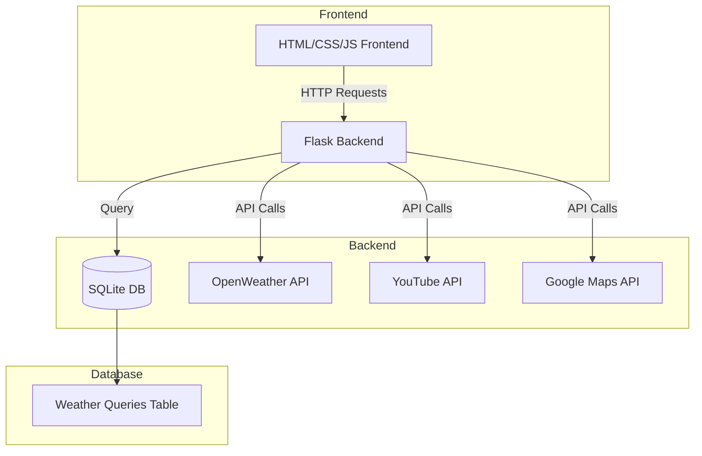
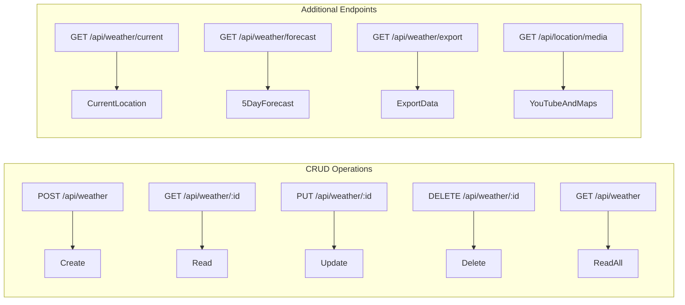

# Weather Application System Design

## 1. System Architecture



## 2. Detailed Implementation Plan

### Database Schema
```sql
CREATE TABLE weather_queries (
    id INTEGER PRIMARY KEY AUTOINCREMENT,
    location TEXT NOT NULL,
    location_type TEXT NOT NULL, -- (zip/coordinates/landmark/city)
    date_range_start DATE NOT NULL,
    date_range_end DATE NOT NULL,
    temperature REAL,
    weather_conditions TEXT,
    created_at TIMESTAMP DEFAULT CURRENT_TIMESTAMP,
    updated_at TIMESTAMP DEFAULT CURRENT_TIMESTAMP
);
```

### API Endpoints



### API Integration Strategy
1. Weather Data (OpenWeather API)
   - Primary source for weather information
   - Fallback to historical data if API is unavailable
   - Cache frequent requests for 30 minutes

2. YouTube Integration
   - Search for location-based travel/weather videos
   - Limit to top 3 most relevant results
   - Cache results for 24 hours

3. Google Maps Integration
   - Convert user input to coordinates
   - Display location on embedded map
   - Support different input formats (ZIP, coordinates, landmarks)

### Error Handling Approach
1. Input Validation
```python
class LocationValidator:
    def validate(location_input):
        # Pattern matching for different formats
        # Returns normalized location data

class DateRangeValidator:
    def validate(start_date, end_date):
        # Validate date range logic
        # Ensure dates are within acceptable bounds
```

2. API Error Handling
```python
class APIErrorHandler:
    def handle_weather_api_error():
        # Fallback to cached data
        # Retry logic with exponential backoff

    def handle_youtube_api_error():
        # Graceful degradation - hide video section

    def handle_maps_api_error():
        # Show text-based location info
```

### Security Considerations
1. Input Sanitization
   - Validate all user inputs
   - Prevent SQL injection
   - Sanitize location data

2. API Security
   - Store API keys in environment variables
   - Rate limiting on all endpoints
   - Request validation middleware

3. Data Protection
   - Sanitize exported data
   - Validate file formats
   - Secure database connections

## 3. File Structure
```
weather-app/
├── backend/
│   ├── main.py                 # Flask application
│   ├── weather_service.py      # Weather API client
│   ├── youtube_service.py      # YouTube API client
│   ├── maps_service.py         # Google Maps API client
│   ├── database.py            # Database operations
│   ├── validators/
│   │   ├── location.py
│   │   └── date_range.py
│   └── error_handlers/
│       └── api_errors.py
├── frontend/
│   ├── index.html
│   ├── styles/
│   │   └── main.css
│   ├── js/
│   │   ├── app.js
│   │   ├── weather.js
│   │   ├── maps.js
│   │   └── export.js
│   └── assets/
│       └── weather-icons/
├── tests/
│   ├── test_weather_service.py
│   ├── test_validators.py
│   └── test_database.py
├── requirements.txt
└── README.md
```

## 4. Validation Rules

### Location Input Validation
```python
LOCATION_PATTERNS = {
    'zip': r'^\d{5}(-\d{4})?$',
    'coordinates': r'^(-?\d+(\.\d+)?),\s*(-?\d+(\.\d+)?)$',
    'city': r'^[A-Za-z\s]{2,},\s*[A-Za-z]{2,}$'
}
```

### Date Range Validation
```python
DATE_RULES = {
    'min_date': 'current_date - 7 days',
    'max_date': 'current_date + 5 days',
    'max_range': '5 days'
}
```

## 5. Export Functionality
- JSON: Full data export with nested structure
- CSV: Flattened data format for spreadsheet compatibility
- PDF: Formatted report with charts and location maps
- Support batch export for multiple records

## 6. Developer Information
- Developer name displayed in navbar
- Info button in top-right corner
- LinkedIn integration with PM Accelerator information
- About modal with application details